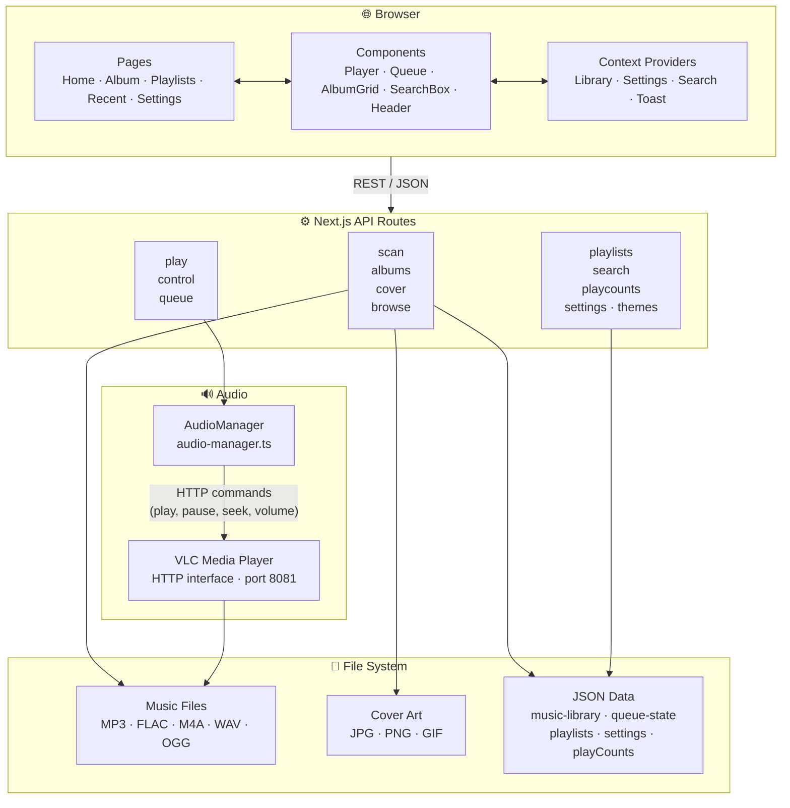

# Jukebox 2.0

A modern, touch-friendly jukebox application built with Next.js and TypeScript. Inspired by TouchTunes — designed for a living room, bar, or party context where the interface needs to look great and work well on any device from phone to desktop.

Audio playback is handled by VLC running in the background; the app communicates with VLC over its HTTP interface.

---

## Features

- **Album library** — Recursively scans a local music directory and organizes tracks by album (folder)
- **Letter navigation** — Jump to any letter in the library; iOS-style index bar on mobile
- **Queue management** — Add individual tracks or full albums, reorder the queue
- **Playlists** — Create, edit, and play saved playlists
- **Search** — Full-text search across albums and tracks
- **Recently played** — Tracks recently played with quick replay
- **Play counts** — Tracks how many times each album has been played
- **Volume control** — Bottom-sheet slider on mobile, inline controls on desktop
- **Cover art** — Automatically finds and serves folder artwork
- **QR code** — Generates a QR code so mobile devices can connect to the same instance
- **Party mode / PIN** — Optional PIN protection to lock settings
- **Admin panel** — Manage library folders and scan paths
- **Themes** — Switchable color themes
- **Responsive** — Optimized for desktop (1024px+), tablet/iPad (768–1024px), and mobile (≤767px)

---

## Architecture



---

## Technology Stack

| Layer | Technology |
|---|---|
| Framework | Next.js 14, React 18 |
| Language | TypeScript 5 |
| Styling | CSS Modules + custom design system |
| Icons | Lucide React |
| Audio backend | VLC Media Player (HTTP API on port 8081) |
| Metadata | music-metadata |
| File I/O | fs-extra |
| QR codes | qrcode |

---

## Prerequisites

1. **VLC Media Player** must be installed and running with its HTTP interface enabled:
   ```
   vlc --intf http --http-host 127.0.0.1 --http-port 8081 --http-password <your-password>
   ```
2. **Node.js** 18+

---

## Installation

```bash
git clone <repository-url>
cd jukebox_2.0
npm install
npm run dev
```

Open [http://localhost:3000](http://localhost:3000). Configure the VLC password and music library path in **Settings** on first run.

---

## Usage

### Scanning your library

1. Go to **Settings** and set your music directory path
2. Click **Scan Music Library** — the app recursively scans and indexes all audio files
3. Each folder at the deepest level is treated as one album

### Browsing and playing

- Browse albums in the grid; use the letter bar to jump by initial
- Click an album to open its track list
- Click any track to play it, or use **Play Album** to queue the whole album
- The player bar at the bottom controls playback, volume, and shows now-playing info

### Supported formats

- **Audio**: MP3, FLAC, M4A, WAV, OGG, AAC
- **Cover art**: JPG, JPEG, PNG, GIF, BMP

---

## Project Structure

```
jukebox_2.0/
├── app/                         # Next.js app router
│   ├── api/                     # API routes
│   │   ├── albums/              # Library retrieval
│   │   ├── browse/              # File browser
│   │   ├── control/             # Playback control (play/pause/volume/seek)
│   │   ├── cover/               # Album art serving
│   │   ├── play/                # Track playback
│   │   ├── playcounts/          # Play count tracking
│   │   ├── playlists/           # Playlist CRUD
│   │   ├── queue/               # Queue management
│   │   ├── scan/                # Library scanning
│   │   ├── search/              # Search
│   │   ├── settings/            # App settings
│   │   └── themes/              # Theme management
│   ├── album/[id]/              # Album detail page
│   ├── classic-library/         # Classic list layout
│   ├── playlists/               # Playlists page
│   ├── recent/                  # Recently played page
│   ├── settings/                # Settings page
│   └── page.tsx                 # Home / album grid
├── components/
│   ├── AppHeader/               # Navigation header
│   ├── AppShell.tsx             # Root layout shell
│   ├── LargeAlbumCard/          # Album card (grid view)
│   ├── LargeAlbumGrid/          # Album grid + letter nav
│   ├── AlbumCard/               # Compact album card
│   ├── Player/                  # Fixed player bar
│   ├── Queue/                   # Queue panel
│   ├── SearchBox/               # Search input + results
│   ├── SearchResults/           # Search result list
│   ├── RecentlyPlayed/          # Recently played panel
│   ├── PlaylistModal/           # Add-to-playlist modal
│   ├── PinPad/                  # Party mode PIN entry
│   ├── MeterBridge/             # VU meter display
│   ├── Toast/                   # Notification toasts
│   └── ...                      # Supporting components
├── contexts/                    # React context providers
│   ├── LibraryContext.tsx       # Library + letter filter state
│   ├── SettingsContext.tsx      # App settings
│   ├── SearchContext.tsx        # Search state
│   └── ToastContext.tsx         # Toast notifications
├── types/
│   └── music.ts                 # Shared TypeScript types
├── audio-manager.ts             # VLC HTTP API wrapper
└── data/                        # Runtime data (auto-created)
    ├── music-library.json
    ├── settings.json
    ├── playlists.json
    ├── queue-state.json
    └── playCounts.json
```

---

## Available Scripts

```bash
npm run dev      # Development server (localhost:3000)
npm run build    # Production build
npm run start    # Production server
npm run lint     # ESLint
```

---

## Design System

Custom CSS variables defined in `app/globals.css`:

- **Colors**: Dark background, cyan accent (`--jukebox-accent`), gold highlights (`--jukebox-gold`)
- **Typography**: Orbitron for display headings, Inter for body text
- **Spacing scale**: `--spacing-xs` through `--spacing-2xl`
- **Breakpoints**: 480px (small mobile), 768px (tablet), 1024px (desktop), 1100px / 1300px (wide desktop)
