# Jukebox 2.0 🎵

A modern, responsive jukebox application built with React and Next.js, designed to manage and play your local music collection. Inspired by TouchTunes, this application provides a beautiful, touch-friendly interface for browsing and playing your music.

## Features

- **🎵 Music Library Scanning**: Recursively scan your local music directories
- **📱 Responsive Design**: Optimized for desktop, tablet, and mobile devices
- **👆 Touch-Friendly Interface**: Large buttons and intuitive controls for touch devices
- **🎨 Modern UI**: Beautiful dark theme with neon accents and smooth animations
- **📊 Album Organization**: Automatically organizes music by albums (folders)
- **🎧 Audio Player**: Full-featured player with progress, volume, and playback controls
- **💾 Local Storage**: Saves your music library index and settings locally
- **🔍 Metadata Extraction**: Reads music file metadata for accurate track information
- **🖼️ Cover Art Support**: Automatically finds and displays album artwork

## Technology Stack

- **Frontend**: React 18, Next.js 14, TypeScript
- **Styling**: CSS Modules with custom design system
- **Icons**: Lucide React
- **Audio**: HTML5 Audio API
- **File Processing**: fs-extra, music-metadata
- **Animations**: CSS animations and Framer Motion

## System Architecture

```mermaid
---
config:
  theme: redux
  look: classic
  layout: elk
---
graph TB
    %% User Interface Layer
    subgraph "Frontend Layer"
        UI[User Interface]
        subgraph "Pages"
            HOME[Home Page]
            SETTINGS[Settings Page]
            PLAYLISTS[Playlists Page]
            RECENT[Recent Page]
            ALBUM[Album Detail Page]
        end
        
        subgraph "Core Components"
            APP_SHELL[AppShell]
            HEADER[AppHeader]
            PLAYER[Player Component]
            QUEUE[Queue Component]
            ALBUM_GRID[AlbumGrid]
            ALBUM_CARD[AlbumCard]
            SEARCH[SearchBox]
        end
        
        subgraph "UI Components"
            TOAST[Toast]
            MODAL[PlaylistModal]
            PINPAD[PinPad]
            SCAN[ScanButton]
            PAGINATION[Pagination]
            QRCODE[QRCode]
        end
    end
    
    %% Context Layer
    subgraph "Context Layer"
        SETTINGS_CTX[SettingsContext]
        LIBRARY_CTX[LibraryContext]
        SEARCH_CTX[SearchContext]
        THEME_CTX[ThemeContext]
        TOAST_CTX[ToastContext]
    end
    
    %% API Layer
    subgraph "API Layer"
        subgraph "Music Management"
            SCAN_API["api/scan"]
            ALBUMS_API["api/albums"]
            COVER_API["api/cover"]
            BROWSE_API["api/browse"]
        end
        
        subgraph "Playback Control"
            PLAY_API["api/play"]
            CONTROL_API["api/control"]
            QUEUE_API["api/queue"]
            AUDIO_API["api/audio"]
        end
        
        subgraph "Settings & Admin"
            SETTINGS_API["api/settings"]
            ADMIN_API["api/admin"]
            THEMES_API["api/themes"]
            LOGS_API["api/logs"]
        end
        
        subgraph "Playlists & Search"
            PLAYLISTS_API["api/playlists"]
            SEARCH_API["api/search"]
            PLAYCOUNTS_API["api/playcounts"]
        end
    end
    
    %% Audio Management Layer
    subgraph "Audio Management"
        AUDIO_MGR[AudioManager]
        AFPLAY_MGR[AFPlayManager]
        VLC_MGR[VLCManager]
        VOLUME_MGR[VolumeManager]
    end
    
    %% Data Layer
    subgraph "Data Layer"
        subgraph "File System"
            MUSIC_FILES["Music Files<br/>MP3, FLAC, M4A, WAV"]
            COVER_ART["Cover Art<br/>JPG, PNG, GIF"]
            METADATA[Music Metadata]
        end
        
        subgraph "Local Storage"
            LIBRARY_JSON[music-library.json]
            SETTINGS_JSON[settings.json]
            PLAYLISTS_JSON[playlists.json]
            QUEUE_JSON[queue-state.json]
            PLAYCOUNTS_JSON[playCounts.json]
            THEMES_JSON[themes.json]
        end
    end
    
    %% External Dependencies
    subgraph "External Dependencies"
        VLC[VLC Media Player]
        AFPLAY[macOS AFPLAY]
        FS[File System API]
        MUSIC_METADATA[music-metadata]
    end
    
    %% Connections
    UI --> SETTINGS_CTX
    UI --> LIBRARY_CTX
    UI --> SEARCH_CTX
    UI --> THEME_CTX
    UI --> TOAST_CTX
    
    SETTINGS_CTX --> SETTINGS_API
    LIBRARY_CTX --> ALBUMS_API
    SEARCH_CTX --> SEARCH_API
    
    SCAN_API --> MUSIC_FILES
    SCAN_API --> METADATA
    ALBUMS_API --> LIBRARY_JSON
    COVER_API --> COVER_ART
    
    PLAY_API --> AUDIO_MGR
    CONTROL_API --> AUDIO_MGR
    QUEUE_API --> QUEUE_JSON
    
    AUDIO_MGR --> VLC_MGR
    AUDIO_MGR --> AFPLAY_MGR
    AUDIO_MGR --> VOLUME_MGR
    
    VLC_MGR --> VLC
    AFPLAY_MGR --> AFPLAY
    
    SETTINGS_API --> SETTINGS_JSON
    PLAYLISTS_API --> PLAYLISTS_JSON
    PLAYCOUNTS_API --> PLAYCOUNTS_JSON
    THEMES_API --> THEMES_JSON
    
    %% Styling
    classDef frontend fill:#e1f5fe
    classDef context fill:#f3e5f5
    classDef api fill:#e8f5e8
    classDef audio fill:#fff3e0
    classDef data fill:#fce4ec
    classDef external fill:#f1f8e9
    
    class UI,HOME,SETTINGS,PLAYLISTS,RECENT,ALBUM,APP_SHELL,HEADER,PLAYER,QUEUE,ALBUM_GRID,ALBUM_CARD,SEARCH,TOAST,MODAL,PINPAD,SCAN,PAGINATION,QRCODE frontend
    class SETTINGS_CTX,LIBRARY_CTX,SEARCH_CTX,THEME_CTX,TOAST_CTX context
    class SCAN_API,ALBUMS_API,COVER_API,BROWSE_API,PLAY_API,CONTROL_API,QUEUE_API,AUDIO_API,SETTINGS_API,ADMIN_API,THEMES_API,LOGS_API,PLAYLISTS_API,SEARCH_API,PLAYCOUNTS_API api
    class AUDIO_MGR,AFPLAY_MGR,VLC_MGR,VOLUME_MGR audio
    class MUSIC_FILES,COVER_ART,METADATA,LIBRARY_JSON,SETTINGS_JSON,PLAYLISTS_JSON,QUEUE_JSON,PLAYCOUNTS_JSON,THEMES_JSON data
    class VLC,AFPLAY,FS,MUSIC_METADATA external
```



## Installation

1. Clone the repository:
```bash
git clone <repository-url>
cd jukebox_2.0
```

2. Install dependencies:
```bash
npm install
```

3. Run the development server:
```bash
npm run dev
```

4. Open [http://localhost:3000](http://localhost:3000) in your browser.

## Usage

### Scanning Your Music Library

1. Click the "Scan Music Library" button
2. Enter the path to your music directory (e.g., `/Users/username/Music` or `C:\Users\username\Music`)
3. The application will recursively scan the directory and organize music by albums
4. Each folder at the lowest level is treated as an album

### Playing Music

1. Browse your albums in the grid view
2. Click the expand button (+) on an album to see its tracks
3. Click the play button on any track to start playback
4. Use the player controls at the bottom to control playback

### Supported File Formats

- **Audio**: MP3, FLAC, M4A, WAV, OGG, AAC
- **Cover Art**: JPG, JPEG, PNG, GIF, BMP

## Project Structure

```
jukebox_2.0/
├── app/                    # Next.js app directory
│   ├── api/               # API routes
│   │   ├── scan/          # Music scanning endpoint
│   │   └── albums/        # Library retrieval endpoint
│   ├── globals.css        # Global styles
│   ├── layout.tsx         # Root layout
│   └── page.tsx           # Main page
├── components/            # React components
│   ├── AlbumCard/         # Individual album display
│   ├── AlbumGrid/         # Album grid layout
│   ├── JukeboxHeader/     # Application header
│   ├── Player/            # Audio player
│   └── ScanButton/        # Library scanning controls
├── types/                 # TypeScript type definitions
│   └── music.ts           # Music-related types
├── data/                  # Local data storage (auto-created)
│   ├── music-library.json # Scanned music library
│   └── settings.json      # Application settings
└── package.json           # Dependencies and scripts
```

## Design System

The application uses a custom CSS design system with:

- **Color Palette**: Dark theme with neon accents (gold, red, blue, purple)
- **Typography**: Orbitron for display text, Inter for body text
- **Spacing**: Consistent spacing scale (xs, sm, md, lg, xl, 2xl)
- **Animations**: Smooth transitions, hover effects, and loading animations
- **Responsive Breakpoints**: Mobile-first design with tablet and desktop optimizations

## API Endpoints

### POST /api/scan
Scans a directory for music files and builds the album index.

**Request Body:**
```json
{
  "path": "/path/to/music/directory"
}
```

**Response:**
```json
{
  "albums": [...],
  "totalTracks": 1234,
  "scanPath": "/path/to/music/directory",
  "scanDate": "2024-01-01T00:00:00.000Z"
}
```

### GET /api/albums
Retrieves the saved music library data.

**Response:**
```json
{
  "albums": [...],
  "scanPath": "/path/to/music/directory"
}
```

## Development

### Available Scripts

- `npm run dev` - Start development server
- `npm run build` - Build for production
- `npm run start` - Start production server
- `npm run lint` - Run ESLint

### Adding New Features

1. Create new components in the `components/` directory
2. Add TypeScript types in `types/` directory
3. Create API routes in `app/api/` directory
4. Use CSS modules for component styling

## Browser Support

- Chrome/Chromium (recommended)
- Firefox
- Safari
- Edge

## License

This project is open source and available under the [MIT License](LICENSE).

## Contributing

1. Fork the repository
2. Create a feature branch
3. Make your changes
4. Add tests if applicable
5. Submit a pull request

## Support

If you encounter any issues or have questions, please open an issue on the GitHub repository. 